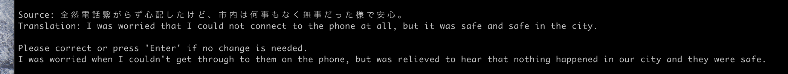

# human-assisted-NMT
UW masters thesis in Computational Linguistics

## Overview
In this thesis, we will build a human-assisted NMT system that aims to maximize the quality of translation, while reducing the total amount of human translator effort involved. At a high level, we construct a system in which we endeavor to use the NMT translation directly when it is of sufficiently high quality, and ask for human feedback to improve the translation only when it is poor. 

The system has two modeling components. The first is a pre-existing black-box NMT model, with which we can obtain a predicted translation for any input. The second is a feedback-requester model, which uses the output of the NMT system, the source sentence, (and possibly additional features of the translation such as the output of a grammar checker) to predict for each sentence whether human translator feedback should be solicited to improve the NMT translation. In addition, the system will have an interface through which requests for human feedback will be made and used to correct the translation. The interface will also display the translated document upon completion for the human translator to further post-edit if desired. All human feedback provided at any stage will be used to improve the feedback-requester model.

## Project Structure

```
human-assisted-NMT
│ README.md, MIT license, requirements.txt, setup.py, etc
│     
│
└───hnmt
│   └───nmt
│   │    │ This directory contains all of the setup and processing necessary for our chosen
│   │    │ "black box" pretrained NMT model.  
│   │    │ Instructions provided below for how to download and tokenize the  NMT system output
│   │    │ to use as input into the feedback-requestor for training and inference.
│   │  
│   │
│   │       
│   │   
│   └───feedback-requester
│         │ Here lives all of the code for the feedback-requester model that uses the NMT output
│         │ to determine whether to prompt a translator for feedback on a given sentence.
│   
│       
│      
│        
└───tests
    │   all of the unit tests live here 
```

## Pretrained NMT model setup and output generation

For this initial proof-of-concept for our system, we are using a pretrained 
Japanese-English NMT model [trained on the JParaCrawl corpus](https://github.com/MorinoseiMorizo/jparacrawl-finetune).

### Requirements for obtaining outputs from the JParaCrawl pretrained model

These instructions assume that you have two files to use as the parellel sentences
saved in some subdirectory of the `nmt` folder (e.g. "/corpus/spm/kyoto-train.ja"
and "/corpus/kftt-data-1.0/data/tok/kyoto-train.en" if using the KFTT corpus-- an
example for how to download and preprocess this data can be found on the JParaCrawl
github).

**1.** Make sure that you have all of the dependencies listed in `requirements.txt` installed, as well as the hnmt package installed.
From the root directory, run the following commands:
```
$ pip3 install -e ./
$ pip3 install -r requirements.txt
```

One additional dependency that you'll need locally is my verison of the fairseq library, which I had to adapt in order to get the NMT model probablity outputs.
```
$ git clone git@github.com:bolducp/fairseq.git
$ cd fairseq
$ git fetch --all
$ git checkout hnmt
$ pip install ./
```

**2.** Download the pretrained model from the JParaCrawl [website](http://www.kecl.ntt.co.jp/icl/lirg/jparacrawl/). There are three sizes available (small, base, and large). Make sure that the `checkpoint_file` parameter used to instaniate the `pretrained_nmt_model` in `nmt/main.py` correctly references the size of the model you downloaded.

**3.** Create a sub-folder in `nmt` called `pretrained_model_jaen` for the pretrained model (should include `dict.en.txt`, `dict.ja.txt`, `LICENSE`, and the model file, e.g. `small.pretrain.pt`).

**4.** Ensure that the `tok_jpn_sents_path` and `tok_en_sents_path` variables in `nmt/main.py` point to your local data paths.

**5.** Run `python3 main.py`, which will save the pickled output to a file called `nmt_out.p` in the `nmt` directory.

### Using output from a different NMT system
To be used as input into the feedback-requester model, NMT output should have the following form List[Tuple[Tuple[str, torch.Tensor], str, str]], where each item in the list represents the NMT system output for a given sentence and the true reference translation. Specifically, each item should be:

((predicted nmt output: str, probabilty score for each word piece: torch.Tensor), input source text: str, gold translation target: str)

For example, here is a single element in the output list:
```
(('Japanese ink-wash painting was completely changed.',
  tensor([-2.2287, -0.1886, -1.6461, -0.5150, -0.6565, -1.1917, -0.8082, -0.9688,
          -0.1424, -0.0960])),
 '▁日本の 水 墨 画 を 一 変 させた 。',
 'He revolutionized the Japanese ink painting .')
```

## Installation and running the feedback-requestor

After installing all of the necessary dependencies, there is one more data preprocessing step needed to obtain sentence and word embeddings to finalize the system input.

### Preparing the input data

Run the `feedback_requester/prepare_nmt_output.py` file. This will generate and save fixed-size sentence embeddings for each of the source sentences first, and then contextual word embeddings for each word piece in the nmt output translation and put it into the final input form.

You can also run the code to generate the source sentence embeddings and NMT output word piece embeddings/final configuration separately by running the commands inside `prepare_nmt_output.py` separately. i.e.:

Source sentence embeddings: 

`run_source_sent_embeddings(saved_nmt_out_file, sent_embeds_file)` 

NMT output word piece embeddings/final configuration: 

`run_final_preprocessing(current_dir + '/preprocessing_outputs/final_out_sample.p')`


## Training the feedback-requester model
`python3 train.py`


## Command Line Interactive Version
To provide a rudimentary interface for interacting with the interactive version for real time use, I've provided a simple CLI. Ultimately, I envision a translator interacting with the system in a more robust, likely web-broswer based setup, where they can directly edit the prompted sentences, rather than having to enter the revised version on a new line, as well as directly edit the final output in the post-editing stage. The only advantage of post-editing the final output and providing it back at the end of the CLI interaction in this setup is that it is used to update the model after each document interaction.


#### To run the CLI version

In the file `hnmt/feedback_requestor/interactive.py`, make sure that the following variables are set to match your local paths:

`MODEL_WEIGHTS_PATH`

`SENT_PIECE_MODEL`

From inside the `feedback_requestor` directory, run interactive.py and follow the prompts:

`python3 interactive.py`

#### Screenshots from a very tiny document example:
Entering the document source text


Correcting a prompted example


Final post editing


### Configurable Settings

The `threshold` parameter value (between 0 and 1) indicating the prediction threshold of the model's prediction for prompting user feedback on a sentence.

The `active_learning` parameter which will use the active learning strategy (described in the paper) for updating the model after each document interaction.


# Experiments

## Prep the parallel data
Download, unzip, and rename the [Japense-English Subtitle Corpus (JESC)](https://nlp.stanford.edu/projects/jesc/)

```
wget https://nlp.stanford.edu/projects/jesc/data/split.tar.gz
tar xzvf split.tar.gz
mv split/train jesc_train.txt
```

## Prepare the training 'documents'
Once the corpus text is available, we run the text through all of the preprocessing and pre-trained NMT model to get the NMT outputs and convert the source sentences for input into the feedback requester model. We also split the text into "documents" of a set number of sentences. The default is 100 sentences per document, but this can be changed by adjusting the `num_sents_per_doc` parameter to the `divided_jesc_docs_nmt_output` function in `prepare_documents.py`.


Make sure that the  `MODEL_PATH`  and  `SAVE_PATH` inputs are set to your local file paths, and run:

`python3 prepare_documents.py`


## Run the simulations
Once you have the output of running `prepare_documents.py` saved locally (i.e. documents input to use to simulate an interaction with a user), you can run the experiments in `simulate_feedback_requester_use.py`.

Make sure to first update the `MODEL_PATH` and `DOCS_PATH` parameters to point to your local files.

Add any additional runs, make sure that the file paths for writing the results match what you'd like them to be locally, and run:

`python3 simulate_feedback_requester_use.py`


## Evaulate the results (i.e. generate graphs)
Check that the file paths in `graphs.py` in `files` matches the saved paths you have locally. You can also specify the name of the subfolder inside of `plots` to save all of the graphs by changing the `dir_name` parameter to the `plot_score_and_acc_over_docs` function. Run:

`python3 graphs.py`
